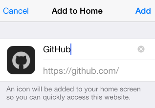
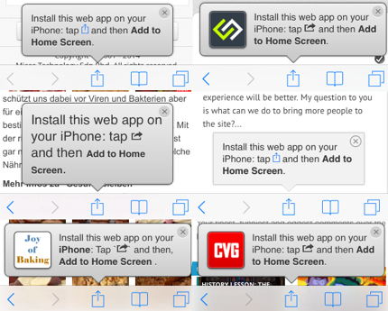
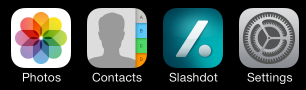
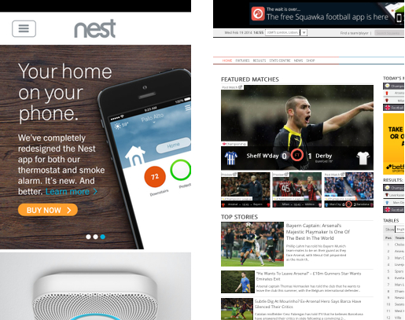
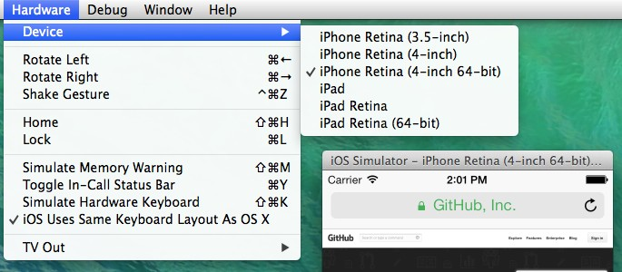
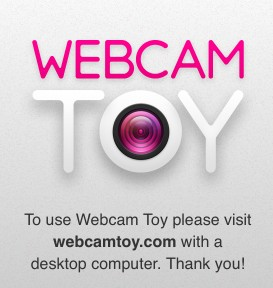

# The state of standalone apps on iOS
For this study, we examined 360 web applications that claim to be capable of running "standalone" in iOS (i.e., the web application asserts that it's usable outside the context of iOS's default browser). We put those claims to the test by manually checking if the apps could, in fact, be used as standalone. To make sure our study is as representative as possible we randomly selected the apps we tested from Alexa's top 78,000 websites.

## Add to home screen
Through the use of the "add to home screen" option in Safari, iOS has allowed users to add web apps to the home screen of an iPhone since the 2009 release of iOS2.1. Web developers could make use of this capability to put their web apps on an equal footing as native apps on the user's home screen.



Over the last 4 years, this capability has seem some uptake in the wild. Through JavaScript libraries, [such as the one created by Matteo Spinelli](http://cubiq.org/add-to-home-screen), iPhone users occasionally encounter a custom pop-up banner suggesting that they "install" the website they are viewing to the home screen.


<figcaption>It's not uncommon to find web applications that ask the user to "install this web app on your iPhone: tap `<icon>` and then **add to homescreen**" on the iPhone.</figcaption>

There are some obvious issues with this pop-up banner approach: not only is it inconsistent across web applications, but it requires developers to both "sniff" for the browser, and then tie a <abbr title="user interface">UI</abbr> component of their own website to that of Safari. 

This is a gamble on the part of the developer, in that Safari can change the look and position of this button at anytime. This problem can be clearly seen above: note there are two kinds of buttons (shown in detail below). If Apple was to relocate or change the look of this button (as it did in iOS7!), it could potentially lead to confusion amongst users.


<figcaption>The iOS6 and iOS7 bookmark buttons, on the left and right respectively.
</figcaption>

It also means that if another browser tries to provide this functionality, it will have to put the bookmark button in the same location as Safari. Or the burden is put on developers to create a new pop-up banner that points to the right spot in the new browser, so users will then know how to add the web application to the home screen. 

Chrome Beta for Android is also [experimenting with adding web applications to the home screen](https://developers.google.com/chrome/mobile/docs/installtohomescreen), so the above may actually start occurring sooner rather than later.

## Purpose of this study
The ability to install a web application to the home screen of a device is currently a topic of interest at the W3C (see the [manifest spec](http://w3c.github.io/manifest/)) and in the web development community:

 * Paul Kinlan's [Add to Home Screen Is Not What the Web Needs. Is It?](http://paul.kinlan.me/Add-to-homescreen-not-the-answer/) 
 * PPK’s thoughts on [Installable Web Apps](http://www.quirksmode.org/blog/archives/2014/02/installable_web.html)
 * [Discussion on twitter](https://twitter.com/marcosc/status/436522185641824256).

As there is no standardized way to do this in browsers, there are a number of working groups trying to piece together all the bits that would be needed to make installable web apps a standard part of the web platform. These groups include [WebApps](http://www.w3.org/2008/webapps/), [SysApps](http://www.w3.org/2012/sysapps/), and the [Web and Mobile IG](http://www.w3.org/Mobile/IG/).    
We hope this study can help inform the standardization of installable web apps currently taking place at the W3C. In particular, we hope that by looking at how developers are making use of the dominant proprietary mobile platform that provides this "add to home screen" capability, we can get an insight into the challenges users, developers, and implementers will face if akin technologies are standardized through the W3C and then become a part of the Web platform.

## Definitions 
A web application <dfn>claims to be standalone</dfn> if it declares the following in its markup:

```HTML
<meta name="apple-mobile-web-app-capable" content="yes">
```

Or its XHTML equivalent:

```HTML
<meta name="apple-mobile-web-app-capable" content="yes" />
```

<dfn>Navigated</dfn> means that the user can follow hyperlinks (or interact with the document) without being thrown back into the default web browser. 

## Key questions
This study set out to answer the following questions. From the sites that claim to function as standalone, how many:

 * Are truly able to function as standalone? 
 * Have a custom icon? 
 * Claim to be standalone, but are actually just desktop sites? 
 * Are standalone and mobile, but don't declare an icon?
 * Claim to be standalone, but have a mistake in their markup that prevents them from working as standalone?

## Key findings
The number of sites claiming to run as standalone is insignificant: of all sites we had access to, they represent 1.4% of the dataset (i.e., 1097 out of 78,155 claim to be [`apple-mobile-web-app-capable`](https://developer.apple.com/library/safari/documentation/AppleApplications/Reference/SafariHTMLRef/Articles/MetaTags.html#//apple_ref/doc/uid/TP40008193-SW3). So, despite this capability being available since 2009, and irrespective of iOS being the dominant mobile platform, few developers bother to create standalone web apps.

Despite these 1097 sites claiming they can be used as standalone, what we found was that the majority of web apps (90%, or 324 out of 360) **can not be used as standalone**. Only a tiny fraction (10%, or 36 out of 360) are able to run as standalone - and 28% of those had significant limitations (described below). There is, in fact, a greater percentage (12%) of desktop sites masquerading as installable web apps than there are actual standalone applications. 

Another significant problem is that 85% (307 out of 360) of apps rely on a user's ability to follow hyperlinks. iOS standalone apps don't support following hyperlinks: unless a developer intervenes via JavaScript, the default action is to open links in Safari. The data effectively busts the myth of "single page apps": we found that almost no developers build single page apps in practice for this class of application.  

Of those 36 apps that were [true standalone web apps](#true-app) (i.e., has an icon, is usable on a mobile device, can be navigated), 10 (28%) of those had issues where they either left the user stranded without being able to "go back" - or worst, suddenly navigated to the desktop version of the site. The only option for a user is to drop back to the home screen and open the application again. This causes iOS to load the page that was originally bookmarked. This itself has problems, in that if the user leaves a web app, its state is effectively lost - meaning the application can lose data. 

In other cases, a web application mostly worked but then it was not possible to perform some critical task within the application (e.g., a purchase). In such cases, the application returned the user back into Safari. Others, like [nest.com](http://nest.com), make a best effort at working as standalone, but throw the user back to the default web browser at random points.  

On the up-side, the majority of web apps (76%) where designed to work on a mobile phone, even if only 13% of those could actually be navigated.

Icon usage, overall, was also fairly healthy - 56% of the web apps we tested included an icon. However, we discovered that at least some web apps included dummy icons from pre-purchased templates - meaning more than one web app included an icon that had nothing to do with the application itself and had the same icon as another site.

Oddly, many web apps (5%, or 19) incorrectly claim that they can run as standalone - but contain a markup error in their HTML that prevents the application from actually doing so! Of those, 12 out of 19 (63%) even go as far as to include an icon. These icons are still useful when the app is added to the home screen or bookmarked - just the web apps won't run as standalone.

For more details, see the "[Other observations](#other-observations)" and the "[all questions](#all-questions)" section.

## Recommendations to implementers/W3C
From our findings, this is what we would recommend implementers and the W3C consider when standardizing this technology.

* It has to be possible for users to follow hyperlinks in standalone applications. Even though iOS doesn't support this functionality, the data clearly shows developers rely on this core capability of the Web.
* It needs to be possible to open some links in the system default browser: it doesn't make sense to open some links, like ads, within the application.
* It has to be possible to open a browser window within the application: this is to allow OAuth style authentication (which are blocked from working in iframes).   
* It needs to be possible for the user to navigate "back". A significant number of a apps, unfortunately, leave users stranded without a way to "go back" in their browsing history. This is sometimes outside the developers control (e.g., an authentication screen at a different domain doesn't support going back). Having some ability to always go back seems critical to make this class of web application usable by the general public.  
* Do not expect, or encourage, developers to create single page applications. Some will, but they will likely do it wrong. Most everyone won't: it's too hard, unnecessary,  and evidently error prone.
* Don't expect applications will have good metadata or icons. 
* Automatically generated metadata and template engines will likely be an issue. A lot of sites don't seem to test (or might not even know) that their websites supports running as standalone. 
* To avoid the issue of UA-specific pop-up banners, a standard way to "install" an application is needed: either through and API and/or some declarative means.
* It needs to be possible to be able to jump between web apps and native apps without requiring the developers to constantly save state. That is, leaving a standalone web application should work the same as jumping from one browser tab to another in a desktop browser. 

## Criteria 
The following is the criteria that we assert an application must meet in order to be a <dfn id="true-app">true standalone application</dfn>. 

Firstly, the web application must have an icon that allows it to be distinguished amongst native applications. This is illustrated below, where the Slashdot icon is easy to locate amongst native iOS applications. 


<figcaption>Slashdot icon amongst native apps.</figcaption>
 
Secondly, all critical functionality of the application is self contained, without requiring browser chrome to make the application usable. Again, the Slashdot web application running as standalone serves to exemplify such functionality. 


<figcaption>Slashdot is fully functional as an application. When necessary, it provides its own interface elements to enable navigations (e.g., a back button). A [video](video/slashdot.mp4) is available.</figcaption>

Thirdly, the web application must be usable on a mobile phone. That is, the application's creator has made an effort to adapt the content of the application to a mobile device — particularly an iPhone. The criteria we used here was: either the app's creator has made an obvious effort to use common conventions of mobile web applications (e.g., a menu button at the top-right hand side of the screen, as shown below); or the content of the web application is legible and UI components are usable without requiring the user to zoom in (achieved by explicitly declaring a `<meta name="viewport" content="width=device-width">`). 


<figcaption>Nest, on the left, exemplifies a typical "mobile site". The Squawka site on the right exemplifies a desktop site masquerading as a standalone web application. Note how the Squawka site would not be easy to use on a mobile device (requires the user to zoom in, pan around, UI components are hard to press, etc.)</figcaption>

## Methods and limitations
This study was conducted using the [webdevddata.org](http://webdevddata.org) dataset. The data was collected over an  approx. 12 hour period on the 31st of October, 2013. Over those hours, the response page from 78,155 domains were collected (the crawler follows redirects and saves any `HTTP 200 OK` response). The [source for the crawler](https://github.com/Webdevdata/fetcher) is available on GitHub.  

The domains are fetched in order (from most popular to least) from Alexia's top 1 million sites at the time the data was downloaded. Note that some domains return the same data (e.g., google.com, google.co.uk, etc.). It is assumed that the size of the dataset reduces the influence of these duplicate domains.   

The dataset was filtered for files that matched the CSS selector `meta[name="apple-mobile-web-app-capable"][content="yes"]` (i.e., any `meta` element that has a `name` attribute "`apple-mobile-web-app-capable`" and whose `content` attribute is "`yes`"). This search was done using a custom tool, which was developed by the WebDevData Community Group. The tool makes use of a HTML parser, so to avoid false positives that would result from simply doing a text search. The tool does not load or execute scripts, however. This means that any website that dynamically inserts `meta` elements cannot be matched by the tool. We assumed that relatively few, if any, sites actually do this - primarily because of the frequency in which `meta` elements appear in HTML pages.  

The list of the resulting 1097 matching files are available as a [gist on Github](https://gist.github.com/ernesto-jimenez/9073492). Statistically speaking, we consider this our [population](http://en.wikipedia.org/wiki/Statistical_population) - i.e., our "set of individuals or objects of interest" as defined on Wikipedia.

To define our sample size, we applied [[Cochran](#cochran)]'s correction formula for populations sizes less than 50,000: 

```
n1 = 384/(1+384/1097)= 284
```

So, according to [[Cochran](#cochran)]'s correction formula, a minimum of 284 sites would need to be sampled to attain a 95% [confidence level](http://www.stats.gla.ac.uk/steps/glossary/confidence_intervals.html#conflevel) (error of 5%). Because we knew there would likely be issues with the sites (e.g., site is down, etc.), and because of redundancies (discussed below), we followed an oversampling technique and randomly selected 500 sites instead. From the 1097 sites, in order to then derive the random sample, the following ECMAScript was used over the dataset.  

```JS
rand = []; 
for(var i = 0; i < 500; i++){ 
  var randKey = Math.random() * data.length; 
  var itemKey = Math.floor(randKey);
  //add it to our collection 
  rand.push(x[itemKey]);
  //remove item just collected 
  x.splice(itemKey, 1);
}
rand.join(",\n")
```

Although we had 500 sites to sample, the reason we ended up with 360 sites was because of time constraints and the redundancies described below. Each site takes about 1 minute to load and check. The sites where manually loaded in Apple's iOS Simulator over a 4 day period between 16-20th of February 2014. The settings for the simulator were "iPhone Retina (4-inch 64Bit)" simulating iOS 7.0. This is shown below.  


<figcaption>iOS simulator and settings.</figcaption>

The [data](https://gist.github.com/marcoscaceres/9041272) is split across four columns:

<dl>
<dt>site</dt> 
<dd>The domian of the site being examined.</dd> 
<dt>icon</dt>
<dd>If the application includes a custom icon</dd>
<dt>mobile</dt>
<dd>Is the site a mobile site.</dd>
<dt>navigates</dt>
<dd>Once launched, is it possible to navigate around the application?</dd>
</dl>

The data is coded as follows:

<dl>
 <dt>0</dt><dd>"no"</dd>
 <dt>1</dt><dd>"yes"</dd>
 <dt>-1</dt><dd>"markup error". Only applies to the "navigation" column.</dd>
</dl>
 
The data was then imported into [SQLite3](http://www.sqlite.org/). 

```SQL
.mode csv
.import apps.csv webapps
```	

As all we needed was count and percentages, SQL queries were then used to perform the statistics. See the "[All questions](#all-questions)" section for the actual SQL used.  

### Redundancies and issues in the data
Although all the domains in the dataset are unique, some domains return the same data as other domains. For example:

* [sc.com](http://sc.com) is the same as [standardchartered.com.sg](http://standardchartered.com.sg)
* Others redundant sites included, [pricegrabber.co.uk](http://pricegrabber.co.uk), [katproxy.com](http://katproxy.com), [pscufs.com](http://pscufs.com), [rezultati.com](http://rezultati.com), [suite101.net](http://suite101.net), and [meusresultados.com](http://meusresultados.com). 

Some sites returned a `HTTP 403 Forbidden` or simply would refused to connect. This happened even though they worked fine when the original dataset was collected in October 2013: 

* [trknck.com](http://trknck.com)
* [partnerspay.com](http://partnerspay.com)
* [pixable.com](http://pixable.com)

Some sites did not provide enough information to test all three aspects (icons, navigation, mobile). For example, [webcamtoy.com](http://webcamtoy.com) contains an icon, is mobile, but doesn't provide any interaction or navigation: it tells the user to go to the desktop site instead. As such, it was excluded. 


<figcaption>[webcamtoy.com](http://webcamtoy.com) tells the user to load the desktop site instead.</figcaption>

Some sites declared themselves as standalone through markup, but when loaded in Safari redirect to a mobile version that excludes the required markup. Some examples of sites that do this:

 * [soniarykiel.com](http://soniarykiel.com)
 * [tapiture.com](http://tapiture.com)
 * [pullandbear.com](http://pullandbear.com)
 * [www.larena.it](http://www.larena.it)

## Other observations
Some sites, like [youbeli.com](http://www.youbeli.com/), ask the user to add their application to the home screen. However, after the user relaunches the application and clicks on any link, they are thrown back into Safari. 

# All questions
This section lists the questions that we could ask from the data we collected; as well as how those questions are expressed as SQL. 

### What percentage of web apps are truly able to function as standalone?

**Answer**: 10%. See the definition of a [true standalone web application](#true-app). See also the caveats below. 

```
select count(*) 
from webapps 
where icons is "1" and navigates is "1" and mobile is "1";
36
```

Some applications allow navigation, but then unexpectedly navigate to the desktop version of the web app:

* [radardedescontos.com.br](http://radardedescontos.com.br)
* [soluto.com](http://soluto.com)
* [kingcounty.gov](http://kingcounty.gov)

Some web apps provide simple interactions like searching. However, they throw the user back into Safari for any critical functionality (e.g., making a purchase):

* [nest.com](http://nest.com)
* [songkick.com](http://songkick.com)
* [suite101.fr](http://suite101.fr)
* [urbita.com](http://urbita.com)

The following web apps work initially, but then leave the user stuck at certain pages. As there is no back button, there is not much the user can do but to quit the app:

* [sumall.com](http://sumall.com)
* [wisedock.de](http://wisedock.de)
* [comediansincarsgettingcoffee.com](http://comediansincarsgettingcoffee.com)

### What percentage of web apps claim to be standalone, but are actually just desktop sites? 
**Answer**: 12%.

```SQL
select select count(*) 
from webapps where
navigates is "0" or navigates is "-1";
43
```

### What percentage of web apps rely on the user being able to follow hyperlinks?
**Answer**: 85%.

```SQL
select count(*)
from webapps 
where navigates is "0" or navigates is "-1";
307
```

### How many web apps are mobile?
**Answer**: 76%.

```SQL
select count(*)
from webapps
where mobile is "1";
274
``` 

### How many web apps are desktop sites?
**Answer**: 24%.

```SQL
select count(*)
from webapps
where mobile is "0";
86
```

### How many web apps have a custom icon? 
**Answer**: 56%.

```SQL
select count(*)
from webapps
where icons is "1";
202
```

Even though some web apps have an icon, the icon is actually from a purchased theme (my theme shop). Hence the icon doesn't match the application. This is indicative that developers don't check their sites or templating will cause issues in the future for installable web apps. 

 * [pixelbell.com](http://pixelbell.com)
 * [smashfreakz.com](http://smashfreakz.com)

### How many web apps DO NOT have a custom icon?
**Answer**: 44%. 

```SQL
select count(*) 
from webapps
where icons is "0";
158
```

### How many web apps can be navigated (irrespective of having an icon or being a mobile site)?
**Answer**: 15%.

```SQL
select count(*) 
from webapps 
where navigates is "1";
53
```

### How many web apps are desktop sites that can be navigated?
**Answer**: 2%.

```SQL
select count(*)
from webapps 
where navigates is "1" and mobile is "0";
6
```

### How many web apps are desktop sites that can be navigated and have an icon?
**Answer**: 1%.

```SQL
select count(*)
from webapps 
where navigates is "1" and mobile is "0" and icons is "1";
2
```

### How many web apps are desktop sites, but include an icon?
**Answer**: 11%.

```SQL
select count(*) 
from webapps 
where icons is "1" and mobile is "0";
38
```

### How many web apps can be navigated, are mobile, but don't declare an icon?
**Answer**: 3%.

```SQL
select count(*) 
from webapps 
where icons is "0" and navigates is "1" and mobile is "1";
11
```

### How many web apps claim to be standalone, but have a mistake in their markup that prevents them from working as standalone?
**Answer**: 5%.

```SQL
select count(*) 
from webapps 
where navigates is "-1";
19
```

### How many web apps don't work as standalone and include an icon?
**Answer**: 12.

```SQL
select count(*) 
from webapps 
where navigates is "-1" and icons is '1';
12
```

# Acknowledgements
Huge thanks to Ernesto Jiménez for writting the WebDevData tools that make processing this data possible and for providing the data about "apple-mobile-web-app-capable". 

# References
<dl>
<dt><dfn id="Cochran">[Cochran]</dfn></dt> 
<dd>Cochran, W. G. (1977). Sampling techniques (3rd ed.). New York: John Wiley & Sons.</dd>
</dl>
